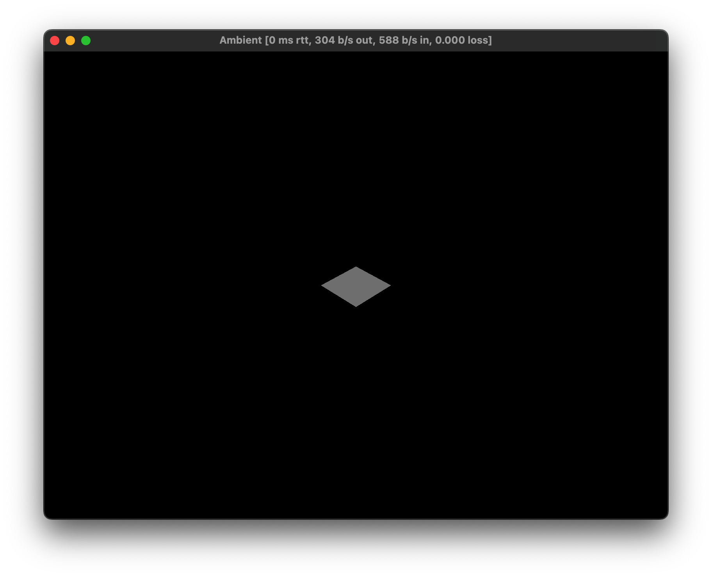

# Chapter 1 Creating a package

To start a new ambient project, type the following in your terminal of choice:

```sh
ambient new my_project
```

This will create a new ambient package.

> A package is a bundle of code and assets which can be deployed. Read more about packages [here](../../reference/package.md).

Enter the project folder by typing `cd my_project`, and then try running it with:

```sh
ambient run
```

You should see a simple scene in front of you now, which looks like this:



> Tip: You can also open the project in VSCode by typing `code .` in the folder, or `code my_project` from the root folder.

> Tip: In VSCode you can hit `F5` to run the project.

> Tip: Run with `--debugger` to show the debugger UI (i.e. `ambient run --debugger`). See [debugging for more info](../../user/debugging.md).
> In VSCode you can switch to the "Debug" launch configuration and then press `F5` to do the same.

Among the console output of ambient you should see a line that says something like:

```
Proxy allocated an endpoint, use `ambient join proxy-eu.ambient.run:9898` to join
```

This can be used to quickly test a multiplayer game; just copy the text in green and run it in another terminal window,
or even on another machine. If you want to try things on the same machine you can also just type:

```sh
ambient join
```

to join the game through another window.

## Package structure

The basic structure of package is as follows:

- `my_package/`
  - `assets/` _This folder contains all assets_
    - `pipeline.json` _A pipeline file decides how the assets will be processsed, [read more here](../../reference/asset_pipeline.md)_
  - `src/` _This folder contains all source code_
    - `client.rs` _This file contains the code that run on your players computers_
    - `server.rs` _This file contains code that runs on the game server_
  - `ambient.toml` _This is where you define ECS components, messages and other data about your package_
  - `Cargo.toml` _This is Rusts equivalent of `ambient.toml`, which defines Rust-specific package things such as Rust dependencies`_

> You can read more about ECS [here](../../reference/ecs.html).

## Server and client?

Ambient is build to be multiplayer by default, which is why each new package comes with a `server.rs` and `client.rs`. You typically define
game logic on the server, whereas the client forwards inputs and adds visual effects.

> For an introduction to [server client, go here](../../user/overview.md)

> Read more here about [where my code should go](../../reference/faq.html#should-my-code-go-on-the-client-or-the-server)?

## IDE setup

If you have installed all the [recommended VS Code tools](../../user/setting_up_ide.md), you should be able to hover your mouse over each concept or component to see the docs:


This will also give you auto-completion and a few other handy tools.

> Tip: Use `ctrl-.` (windows, or `cmd-.` on osx) to bring up VSCode suggestions, such as help to automatically import dependencies

## Challenge

Try to create some cubes and change their `translation()`, `scale()`, `rotation()` components.

> Tip: You can refer to the [primitives example](https://github.com/AmbientRun/Ambient/blob/main/guest/rust/examples/basics/primitives/src/server.rs) in the Ambient main GitHub repository.

## [ ⇾ Chapter 2: Player character](./2_player_character.md)
