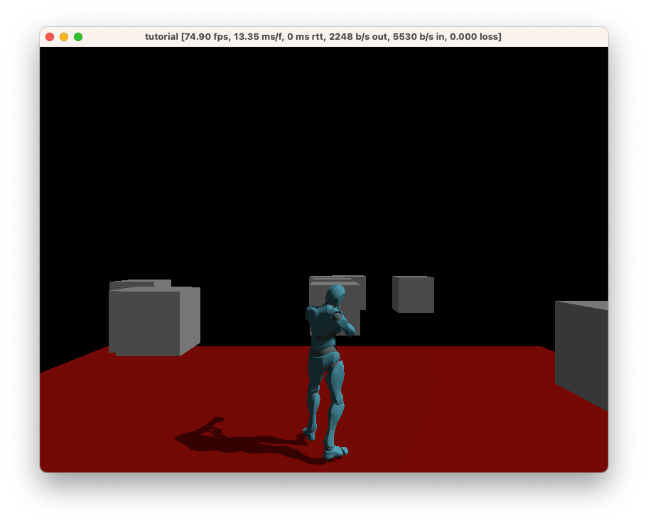

# Chapter 3: Creating the scene

In this chapter, our goal is to create cube obstacles that the player has to walk around, and then we'll rain bouncy balls down to add dynamism to the scene.

## Adding some obstacles

Let's add some basic obstacles to your game. Add the following code:

```rust
for _ in 0..30 {
    Entity::new()
        .with(cube(), ())
        .with(cube_collider(), Vec3::ONE)
        .with(
            translation(),
            (random::<Vec2>() * 20.0 - 10.0).extend(1.),
        )
        .spawn();
}
```

This code will spawn 30 cubes with random positions. Try running it!

> **In-depth**: A `cube_collider` is one of the basic physics primitives. For more information, consult [the reference documentation on physics](../../reference/physics.md), or try the [physics example](https://github.com/AmbientRun/Ambient/tree/main/guest/rust/examples/basics/physics).

> **Challenge**: `Entity::spawn` will return an `EntityId`. Try using [`set_component`](https://docs.ambient.run/nightly/ambient_api/entity/fn.set_component.html) to set the `rotation` of the cubes.

It should look something like this:



## Creating a rain of bouncy balls

We can also spawn some interactive physics elements. Add the following to make it rain bouncy balls:

```rust
fixed_rate_tick(Duration::from_secs_f32(0.5), |_| {
    Entity::new()
        .with_merge(Sphere::suggested())
        .with_merge(Transformable::suggested())
        .with(scale(), Vec3::ONE * 0.2)
        .with(
            translation(),
            Vec3::X * 10. + (random::<Vec2>() * 2.0 - 1.0).extend(10.),
        )
        .with(sphere_collider(), 0.5)
        .with(dynamic(), true)
        .spawn();
});
```

This code will spawn a bouncy ball at a semi-random position each frame, where `Sphere` and `Transformable` are [concepts](../../reference/ecs.md#concepts) that provide the components required for a sphere that can be moved around.

> **In-depth**: Here, we're using a `Frame` message, which is sent by the runtime each frame. Learn more about messages in [the reference documentation](../../reference/messages.md).

Try running this. You should see a rain of bouncy balls now!


However, there's quite a big problem: the bouncy balls never expire, so the world keeps filling up. Let's fix that.

To begin with, we're going to add this to the `ambient.toml`:

```toml
[components]
bouncy_created = { type = "Duration" }
```

> **In-depth**: Here, we're defining a custom component. For more information on how component definitions work, as well as what they're capable of, check out [the reference documentation](../../reference/ecs.md#components).

Next, we're going to add the component to the bouncy balls. The `with` line needs to be placed before the `spawn` function, like so:

```diff
.with(sphere_collider(), 0.5)
.with(dynamic(), true)
+ .with(bouncy_created(), game_time())
.spawn();
```

> **In-depth**: Components are added in the order that you specify them, so it's possible to override an earlier component with a later one. In this case, it doesn't matter where you place the `bouncy_created` component as long as it's prior to the entity being spawned.

Finally, add this code at the end of your `main` function:

```rust
query(bouncy_created()).each_frame(|entities| {
    for (id, created) in entities {
        if (game_time() - created).as_secs_f32() > 5.0 {
            entity::despawn(id);
        }
    }
});
```

> **In-depth**: Here, we see a query which runs every frame. It grabs all entities with the `bouncy_created` component and removes all components that are older than 5 seconds.

> **Note**: Ambient offers a `remove_at_game_time` component that will do this for you, but we're using this as an example of how to write a component definition and query. As an example of how you would use `remove_at_game_time`, you can replace the above code with the following:
>
> ```diff
> .with(sphere_collider(), 0.5)
> .with(dynamic(), true)
> + .with(remove_at_game_time(), game_time() + Duration::from_secs(5))
> .spawn();
> ```

> **Source**: The complete code for this chapter can be found [here](https://github.com/AmbientRun/TutorialProject/tree/chapter-3).

## [⇾ Chapter 4: Player interaction](./4_player_interaction.md)
