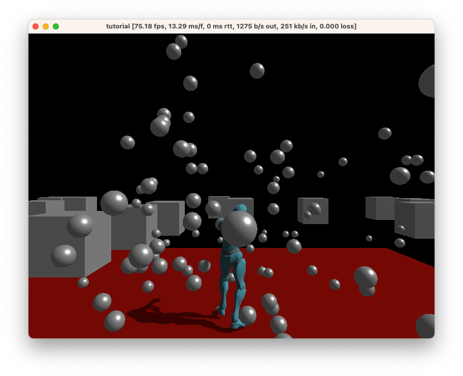

# Chapter 3: Creating the scene

In this chapter we'll create some basic blocks that the player can't walk through, and
then we'll add a rain of bouncy balls.

## Adding some obstacles

Let's add some basic obstacles to your game. Add the following code:

```rust
for _ in 0..30 {
    Entity::new()
        .with(cube(), ())
        .with(cube_collider(), Vec3::ONE * 0.5)
        .with(
            translation(),
            (rand::random::<Vec2>() * 20.0 - 10.0).extend(1.),
        )
        .spawn();
}
```

> A `cube_collider` is one of the basic physics primitives. [Read more about physics here](../../reference/physics.md),
> or try the [physics example](https://github.com/AmbientRun/Ambient/tree/main/guest/rust/examples/basics/physics).

It should look something like this:


## Creating a bouncy ball rain

We can also spawn some interactive physics elements. Add the following to make it rain bouncy balls:

```rust
Frame::subscribe(|_| {
    Entity::new()
        .with_merge(Sphere::suggested())
        .with_merge(Transformable::suggested())
        .with(scale(), Vec3::ONE * 0.2)
        .with(
            translation(),
            Vec3::X * 10. + (rand::random::<Vec2>() * 2.0 - 1.0).extend(10.),
        )
        .with(sphere_collider(), 0.5)
        .with(dynamic(), true)
        .spawn();
});
```

> Here we're using a `Frame` message, which is sent by the runtime each frame. [Read more about messages here](../../reference/messages.md).

Try running this. You should see a rain of bouncy balls now!



But we have a problem; the bouncy balls never expire, so the world keeps filling up. Let's fix that.

First, we're going to add this to the `ambient.toml`:

```toml
[components]
bouncy_created = { type = "Duration" }
```

> In depth: Here we're defining a custom component. [Read more about components here](../../reference/ecs.md#components)

Then add the following to the bouncy ball entity:

```rust
.with(bouncy_created(), game_time())
```

Finally, add this code at the end of your main function:

```rust
query(bouncy_created()).each_frame(|entities| {
    for (id, created) in entities {
        if (game_time() - created).as_secs_f32() > 5.0 {
            despawn(id);
        }
    }
});
```

> In depth: Here we see a query which runs each frame. It grabs all entities with the `bouncy_created` component and
> removes all components that are older than 5 seconds.

## [ ⇾ Chapter 4: Player interaction](./4_player_interaction.md)
