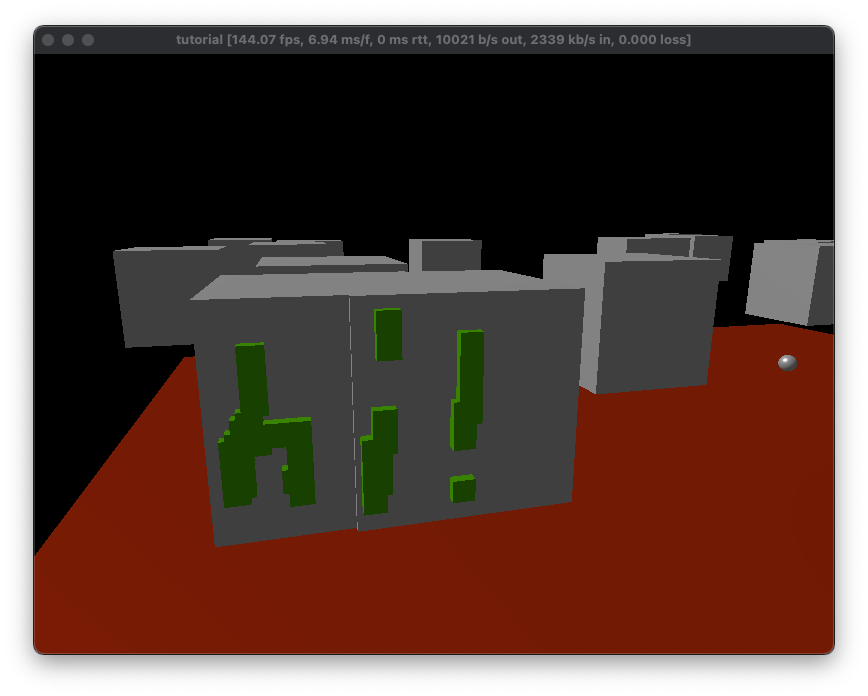

# Chapter 4: Player interaction

It wouldn't be much of a game if we didn't have some player interaction though! Let's add that.

## A simple paint interaction

First, we'll add a `Paint` message to our `ambient.toml`:

```toml
[message.Paint]
fields = { ray_origin = "Vec3", ray_dir = "Vec3" }
```

> **In-depth**: Read more about defining your own messages in [the reference documentation](../../reference/messages.md).

Next, we'll add some code to the **`client.rs`** (for the first time in this tutorial!):

```rust
fixed_rate_tick(Duration::from_millis(20), move |_| {
    let Some(camera_id) = camera::get_active() else {
        return;
    };

    let input = input::get();
    if input.keys.contains(&KeyCode::Q) {
        let ray = camera::clip_position_to_world_ray(camera_id, Vec2::ZERO);

        Paint {
            ray_origin: ray.origin,
            ray_dir: ray.dir,
        }
        .send_server_unreliable();
    }
});
```

This code runs every 20 milliseconds, gets the active camera (and does nothing if it can't), then checks if the `Q` key is pressed. If it is, it sends a `Paint` message to the server with the information required to perform a raycast to determine where to paint. The `fixed_rate_tick` is used to ensure that we don't spam the server with messages on high frame rates.

> **In-depth**: For a more detailed example of how to use screen rays, see [the `screen_ray` example](https://github.com/AmbientRun/Ambient/tree/main/guest/rust/examples/intermediate/screen_ray).

Let's add this to our `server.rs`:

```rust
Paint::subscribe(|ctx, msg| {
    if ctx.client_user_id().is_none() {
        return;
    }

    let Some(hit) = physics::raycast_first(msg.ray_origin, msg.ray_dir) else {
        return;
    };

    Entity::new()
        .with(cube(), ())
        .with(translation(), hit.position)
        .with(scale(), Vec3::ONE * 0.1)
        .with(color(), vec4(0., 1., 0., 1.))
        .spawn();
});
```

This code will listen for messages. For each message, it will ensure that the message came from the client and then perform a raycast; if it hits something, it will spawn a green cube at the hit position.

When you run it, you should now be able to "paint" by holding/pressing `Q`:



## [⇾ Chapter 5: Models](./5_models.md)
